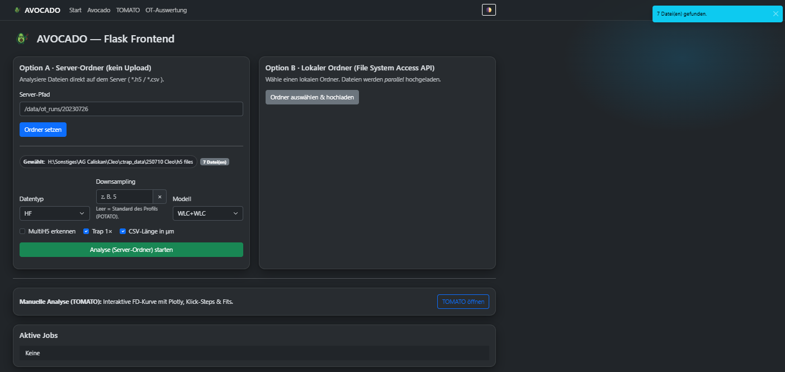
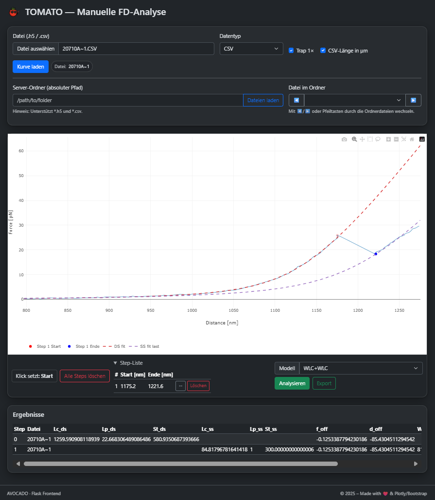
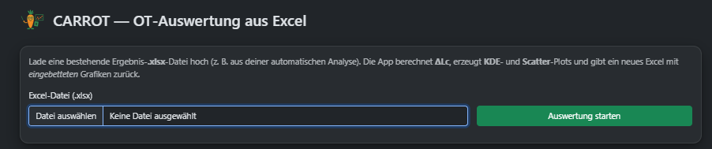
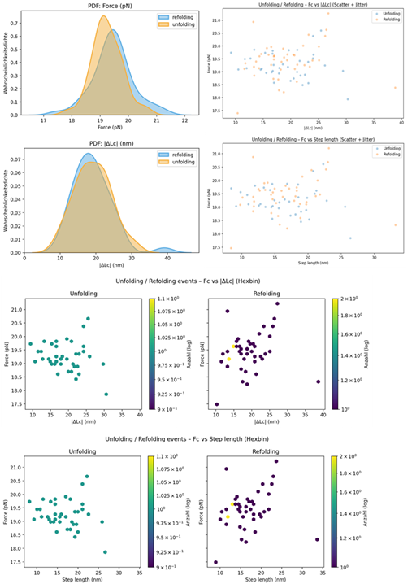
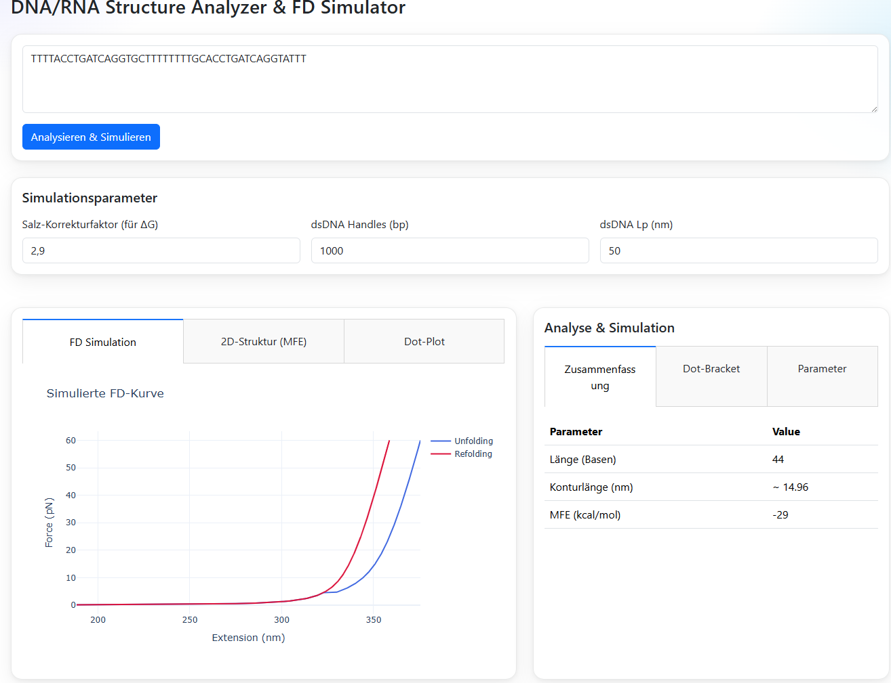
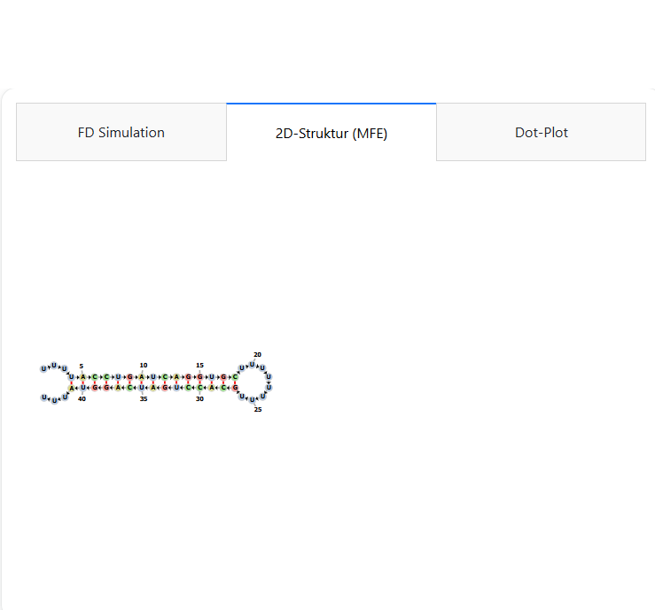

# AVOCADO Suite 🥑
Ein Flask-Webfrontend zur Analyse und Simulation von Optical-Tweezers-Daten. Dieses Projekt erweitert die Funktionalität des POTATO-Backends um interaktive Web-Interfaces https://github.com/lpekarek/FRIED_POTATO.

Erstellt von Tobias Fremter/Biochemie 3, Universität Regensburg.

## Module
Die Suite besteht aus vier Hauptmodulen, die jeweils für spezifische Analyse-Workflows konzipiert sind:


### 🥑 Avocado (Batch-Analyse)
    

-   Batch-Analyse von *.h5 / *.csv\* direkt aus Server-Ordnern
-   Multiprocessing-Jobhandling mit Fortschritts-Logs
-   Automatische FD-Plots und Exporte (SMOOTH, PLOT, STEPS, TOTAL, FIT)
-   Download einzelner Ergebnisdateien oder als ZIP


### 🍅 Tomato (Interaktive FD-Kurven)


-   Einzeldateien (Upload oder Serverpfad) laden
-   Interaktive Step-Erkennung und manuelles Setzen
-   DS-Fit und SS-Fits zwischen Steps
-   Berechnung der Arbeit (pN·nm, kT)
-   Export ins standardisierte OT-Schema (CSV + XLSX im ZIP)


### 🥕 Carrot (Excel Post-Processing)


-   Bestehende POTATO-Ergebnis-Excel laden
-   Berechnung von ΔLc via eFJC-Modell (physikalisch)
-   Plots:
    -   **KDE Force**
    -   **KDE \|ΔLc\|**
    -   **Scatter Fc vs \|ΔLc\|** (Unfolding/Refolding, farblich getrennt)
    -   **Scatter Fc vs Step length** (falls Spalte vorhanden)
-   Ergebnis: neue Excel mit Datenblatt und eingebetteten Plots

## Beispielplot



### 🥦 Broccoli (RNA-Struktur & Simulation)
Analysiert RNA/DNA-Sequenzen, sagt 2D-Strukturen voraus, simuliert FD-Kurven und ermöglicht in silico Mutagenese-Analysen zum direkten Vergleich von Wildtyp und Mutante.




## Installation (Empfohlen: via Conda)
Um Installationsprobleme mit komplexen wissenschaftlichen Paketen (insb. unter Windows) zu vermeiden, wird die Verwendung von Miniconda dringend empfohlen.

### 1. Miniconda installieren
Laden Sie den Miniconda-Installer für Windows von der offiziellen Webseite herunter (wählen Sie den neuesten Python 3.x Installer).

Führen Sie die Installation mit den Standardeinstellungen durch.

### 2. Conda-Umgebung erstellen & aktivieren
Öffnen Sie den "Anaconda Prompt" aus dem Startmenü.

Erstellen Sie eine neue, saubere Umgebung für das Projekt (der Name avocado-env ist ein Beispiel):

``` conda create -n avocado-env python=3.11 ```

Aktivieren Sie die neue Umgebung:

``` conda activate avocado-env ```

3. Projekt klonen
Klonen Sie dieses Repository in einen Ordner Ihrer Wahl:

``` git clone [https://github.com/pUC19/AVOCADO.git](https://github.com/pUC19/AVOCADO.git) ```
``` cd AVOCADO ```

4. Python-Module installieren
WICHTIG: Verwenden Sie Conda, um die Pakete zu installieren, die oft Compiler-Fehler verursachen:

``` conda install -c conda-forge dash-bio viennarna pandas ```

Installieren Sie die restlichen Pakete mit pip aus der requirements.txt-Datei:

``` pip install -r requirements.txt ```

Einrichtung in Visual Studio Code
Öffnen Sie den Projekt-Ordner (AVOCADO) in VS Code.

Öffnen Sie die Befehlspalette (Strg + Umschalt + P).

Suchen und wählen Sie den Befehl Python: Select Interpreter.

Wählen Sie Ihre neu erstellte Conda-Umgebung (avocado-env) aus der Liste aus.

Öffnen Sie ein neues Terminal in VS Code (Strg + Ö). Es sollte jetzt automatisch die (avocado-env) Umgebung aktiviert haben.

Anwendung starten
Führen Sie den folgenden Befehl im VS Code Terminal aus (stellen Sie sicher, dass die (avocado-env) Umgebung aktiv ist):

``` python app.py ```

Die Anwendung ist nun unter http://127.0.0.1:5000/ erreichbar.
